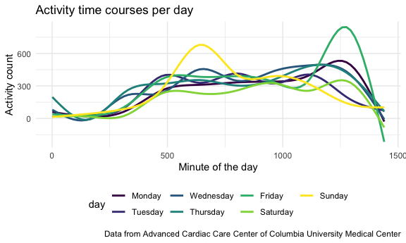
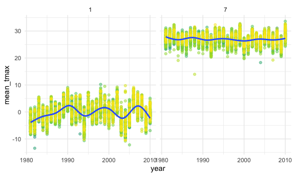

Homework 3
================
Gauri Bhatkhande

## Problem 1

``` r
data("instacart")
```

This dataset contains 1384617 rows and 15 columns.

Observations are the level of items in orders by user. There are
user/order variables – and item variables. order\_id, product\_id,
add\_to\_cart\_order, reordered, user\_id, eval\_set, order\_number,
order\_dow, order\_hour\_of\_day, days\_since\_prior\_order,
product\_name, aisle\_id, department\_id, aisle, department

How many aisles and which are most items from?

``` r
instacart %>%
  count(aisle) %>%
  arrange(desc(n))
```

    ## # A tibble: 134 x 2
    ##    aisle                              n
    ##    <chr>                          <int>
    ##  1 fresh vegetables              150609
    ##  2 fresh fruits                  150473
    ##  3 packaged vegetables fruits     78493
    ##  4 yogurt                         55240
    ##  5 packaged cheese                41699
    ##  6 water seltzer sparkling water  36617
    ##  7 milk                           32644
    ##  8 chips pretzels                 31269
    ##  9 soy lactosefree                26240
    ## 10 bread                          23635
    ## # … with 124 more rows

Lets make a plot

``` r
instacart %>%
  count(aisle) %>%
  filter(n > 10000) %>% 
  mutate(
    aisle = factor(aisle), 
    aisle = fct_reorder(aisle, n)
  )%>%
  ggplot(aes(x = aisle, y = n)) +
  geom_point() +
  theme(axis.text.x = element_text(angle = 90, vjust = 0.5, hjust = 1))
```


Lets make a table

``` r
instacart %>%
  filter(aisle %in% c("baking ingredients", "dog food care", "packaged vegetables fruits")) %>%
  group_by(aisle) %>%
  count(product_name) %>%
  mutate(rank = min_rank(desc(n))) %>%
  filter(rank < 4) %>%
  arrange(aisle, rank) %>%
    knitr::kable()
```

| aisle                      | product\_name                                 |    n | rank |
| :------------------------- | :-------------------------------------------- | ---: | ---: |
| baking ingredients         | Light Brown Sugar                             |  499 |    1 |
| baking ingredients         | Pure Baking Soda                              |  387 |    2 |
| baking ingredients         | Cane Sugar                                    |  336 |    3 |
| dog food care              | Snack Sticks Chicken & Rice Recipe Dog Treats |   30 |    1 |
| dog food care              | Organix Chicken & Brown Rice Recipe           |   28 |    2 |
| dog food care              | Small Dog Biscuits                            |   26 |    3 |
| packaged vegetables fruits | Organic Baby Spinach                          | 9784 |    1 |
| packaged vegetables fruits | Organic Raspberries                           | 5546 |    2 |
| packaged vegetables fruits | Organic Blueberries                           | 4966 |    3 |

Apples vs ice cream

``` r
instacart %>%
  filter(product_name %in% c("Pink Lady Apples", "Coffee Ice Cream"))%>%
  group_by(product_name, order_dow) %>%
  summarize(mean_hour = mean(order_hour_of_day)) %>%
pivot_wider(
  names_from = order_dow, 
  values_from = mean_hour
)
```

    ## `summarise()` regrouping output by 'product_name' (override with `.groups` argument)

    ## # A tibble: 2 x 8
    ## # Groups:   product_name [2]
    ##   product_name       `0`   `1`   `2`   `3`   `4`   `5`   `6`
    ##   <chr>            <dbl> <dbl> <dbl> <dbl> <dbl> <dbl> <dbl>
    ## 1 Coffee Ice Cream  13.8  14.3  15.4  15.3  15.2  12.3  13.8
    ## 2 Pink Lady Apples  13.4  11.4  11.7  14.2  11.6  12.8  11.9

## Problem 2

Loading the dataset

``` r
accelero_data = read_csv(file = "./Data/accel_data.csv")
```

    ## Parsed with column specification:
    ## cols(
    ##   .default = col_double(),
    ##   day = col_character()
    ## )

    ## See spec(...) for full column specifications.

Tidying and wrangling the dataset

``` r
accelero_data = janitor::clean_names(accelero_data) %>%
                pivot_longer(
                   activity_1:activity_1440,
                   names_to = "activity_for_minute",
                   values_to = "activity_count") %>%
  separate(activity_for_minute, c("word", "minute_of_the_day"), "_") %>%
  select(-word) %>%
  mutate(
    minute_of_the_day = as.numeric(minute_of_the_day)
  ) %>%
  mutate(
    day = factor(day, levels = c("Monday", "Tuesday", "Wednesday", "Thursday", "Friday", "Saturday", "Sunday"))
        )%>%
  mutate(day_type = case_when(day %in% c("Monday", "Tuesday", "Wednesday", "Thursday", "Friday") ~ "Weekday",
                              day %in% c("Saturday", "Sunday") ~ "Weekend")
        )
accelero_data
```

    ## # A tibble: 50,400 x 6
    ##     week day_id day    minute_of_the_day activity_count day_type
    ##    <dbl>  <dbl> <fct>              <dbl>          <dbl> <chr>   
    ##  1     1      1 Friday                 1           88.4 Weekday 
    ##  2     1      1 Friday                 2           82.2 Weekday 
    ##  3     1      1 Friday                 3           64.4 Weekday 
    ##  4     1      1 Friday                 4           70.0 Weekday 
    ##  5     1      1 Friday                 5           75.0 Weekday 
    ##  6     1      1 Friday                 6           66.3 Weekday 
    ##  7     1      1 Friday                 7           53.8 Weekday 
    ##  8     1      1 Friday                 8           47.8 Weekday 
    ##  9     1      1 Friday                 9           55.5 Weekday 
    ## 10     1      1 Friday                10           43.0 Weekday 
    ## # … with 50,390 more rows

The variables in the data are week, day\_id, day, minute\_of\_the\_day,
activity\_count, day\_type. There are 50400 rows (observations) and 6
columns in the dataset. The number of rows or observations signifies
activity count for each minute of the day for each day of the week for 5
weeks (35 days).

Making a table of total activity for each day of the week

``` r
accelero_data %>%
  group_by(week, day) %>%
  summarize(total_activity = sum(activity_count)) %>%
 knitr::kable()
```

    ## `summarise()` regrouping output by 'week' (override with `.groups` argument)

| week | day       | total\_activity |
| ---: | :-------- | --------------: |
|    1 | Monday    |        78828.07 |
|    1 | Tuesday   |       307094.24 |
|    1 | Wednesday |       340115.01 |
|    1 | Thursday  |       355923.64 |
|    1 | Friday    |       480542.62 |
|    1 | Saturday  |       376254.00 |
|    1 | Sunday    |       631105.00 |
|    2 | Monday    |       295431.00 |
|    2 | Tuesday   |       423245.00 |
|    2 | Wednesday |       440962.00 |
|    2 | Thursday  |       474048.00 |
|    2 | Friday    |       568839.00 |
|    2 | Saturday  |       607175.00 |
|    2 | Sunday    |       422018.00 |
|    3 | Monday    |       685910.00 |
|    3 | Tuesday   |       381507.00 |
|    3 | Wednesday |       468869.00 |
|    3 | Thursday  |       371230.00 |
|    3 | Friday    |       467420.00 |
|    3 | Saturday  |       382928.00 |
|    3 | Sunday    |       467052.00 |
|    4 | Monday    |       409450.00 |
|    4 | Tuesday   |       319568.00 |
|    4 | Wednesday |       434460.00 |
|    4 | Thursday  |       340291.00 |
|    4 | Friday    |       154049.00 |
|    4 | Saturday  |         1440.00 |
|    4 | Sunday    |       260617.00 |
|    5 | Monday    |       389080.00 |
|    5 | Tuesday   |       367824.00 |
|    5 | Wednesday |       445366.00 |
|    5 | Thursday  |       549658.00 |
|    5 | Friday    |       620860.00 |
|    5 | Saturday  |         1440.00 |
|    5 | Sunday    |       138421.00 |

He tends to have more physical activity during the weekdays than the
weekends for the first couple of weeks. Later his activity on weekends
increases. However, during the Saturdays of the 4th and 5th weeks, he
had barely any activity. They could have been rest days.

``` r
  accelero_data %>%
  ggplot(aes(x = minute_of_the_day, y = activity_count, color = day, )) + stat_smooth(se=FALSE) +
  labs(
      title = "Activity time courses per day",
    x = "Minute of the day",
    y = "Activity count",
    caption = "Data from Advanced Cardiac Care Center of Columbia University Medical Center"
  ) +
  theme(legend.position = "bottom")
```

    ## `geom_smooth()` using method = 'gam' and formula 'y ~ s(x, bs = "cs")'



``` r
ggsave("problem2_plot.pdf", height = 4, width = 6)  
```

    ## `geom_smooth()` using method = 'gam' and formula 'y ~ s(x, bs = "cs")'

``` r
ggsave("problem2_plot.png", height = 4, width = 6)  
```

    ## `geom_smooth()` using method = 'gam' and formula 'y ~ s(x, bs = "cs")'

Except for Sunday, Most of the activity is higher during the latter half
of the day. It appears that on Fridays the activity counts were the
highest among all days for the later half of the day. On Sunday the
activity is high towards the middle of the day.

## Problem 3

``` r
library(p8105.datasets)
data("ny_noaa")
```

### Description of the data

The dataset has 2595176 rows (observations) and 7 columns. The variables
included are id, date, prcp, snow, snwd, tmax, tmin. It has information
about the weather including precipitation, snowfall, snow depth, maximum
and minimum temperatures observed on different dates.

**Data cleaning and Creating separate variables for year, month, date.
Ensuring observations are in reasonable units.**

``` r
ny_noaa_clean = janitor::clean_names(ny_noaa) %>%
separate (date, c("year", "month", "date"), "-") %>%
  mutate(
    tmin = as.numeric(tmin), 
    tmax = as.numeric(tmax), 
    year = as.numeric(year),
    month = as.numeric(month),
    date = as.numeric(date)) %>%
  mutate(
    prcp = prcp/10,
    tmax = tmax/10,
    tmin = tmin/10 )

head(ny_noaa_clean)
```

    ## # A tibble: 6 x 9
    ##   id           year month  date  prcp  snow  snwd  tmax  tmin
    ##   <chr>       <dbl> <dbl> <dbl> <dbl> <int> <int> <dbl> <dbl>
    ## 1 US1NYAB0001  2007    11     1    NA    NA    NA    NA    NA
    ## 2 US1NYAB0001  2007    11     2    NA    NA    NA    NA    NA
    ## 3 US1NYAB0001  2007    11     3    NA    NA    NA    NA    NA
    ## 4 US1NYAB0001  2007    11     4    NA    NA    NA    NA    NA
    ## 5 US1NYAB0001  2007    11     5    NA    NA    NA    NA    NA
    ## 6 US1NYAB0001  2007    11     6    NA    NA    NA    NA    NA

**For snowfall, to find the most commonly observed values? Why?**

``` r
ny_noaa_clean %>%
  count(snow, sort = TRUE )%>%
  slice (1:5)
```

    ## # A tibble: 5 x 2
    ##    snow       n
    ##   <int>   <int>
    ## 1     0 2008508
    ## 2    NA  381221
    ## 3    25   31022
    ## 4    13   23095
    ## 5    51   18274

The most commonly observed value is 0 mm. This is because for most of
the time in the year, it does not snow and hence it is 0

``` r
pl = ny_noaa_clean %>%
  filter(month %in% c(1,7)) %>%
  group_by(id,year,month) %>%
  summarize(mean_tmax = mean(tmax,na.rm=TRUE))
```

    ## `summarise()` regrouping output by 'id', 'year' (override with `.groups` argument)

``` r
ggplot(pl,aes(x = year, y = mean_tmax)) +geom_point(aes(colour = id),alpha = 0.5) + geom_smooth() +facet_grid(. ~month)
```

    ## `geom_smooth()` using method = 'gam' and formula 'y ~ s(x, bs = "cs")'

    ## Warning: Removed 5970 rows containing non-finite values (stat_smooth).

    ## Warning: Removed 5970 rows containing missing values (geom_point).



``` r
ggsave("problem3_plot2.png")
```

    ## Saving 6 x 3.6 in image

    ## `geom_smooth()` using method = 'gam' and formula 'y ~ s(x, bs = "cs")'

    ## Warning: Removed 5970 rows containing non-finite values (stat_smooth).
    
    ## Warning: Removed 5970 rows containing missing values (geom_point).
